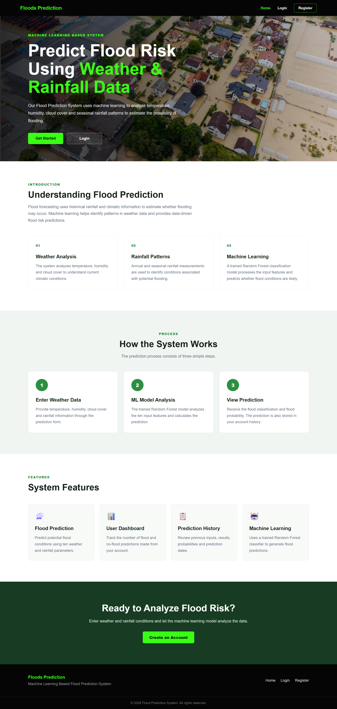
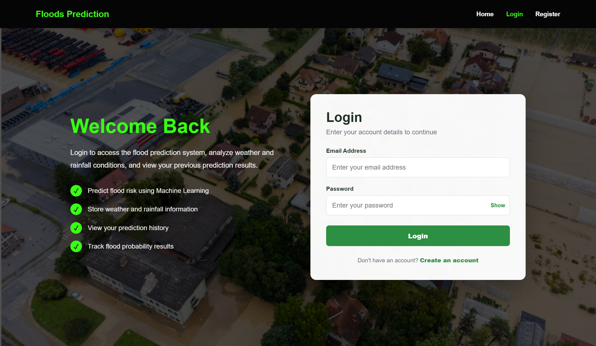
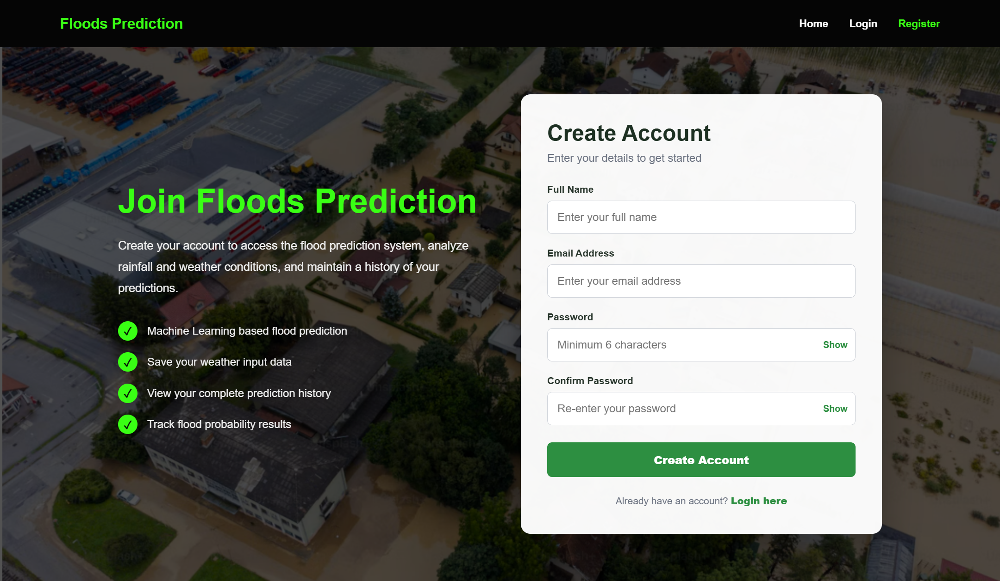
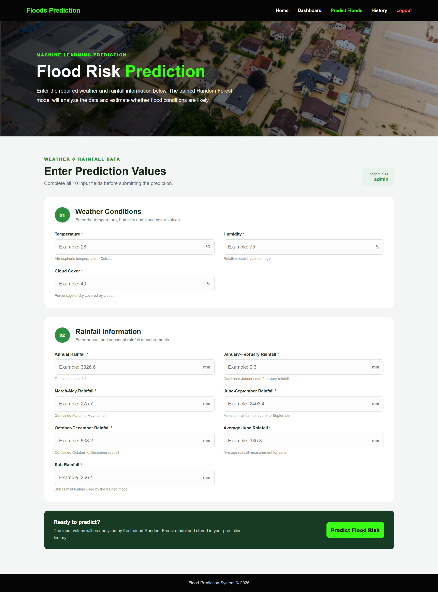
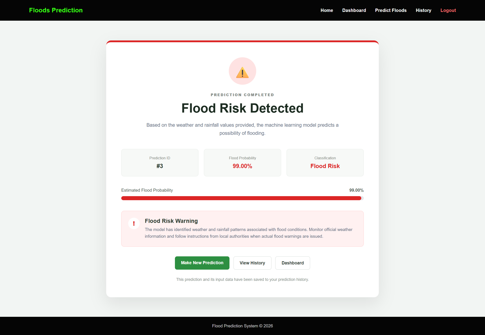
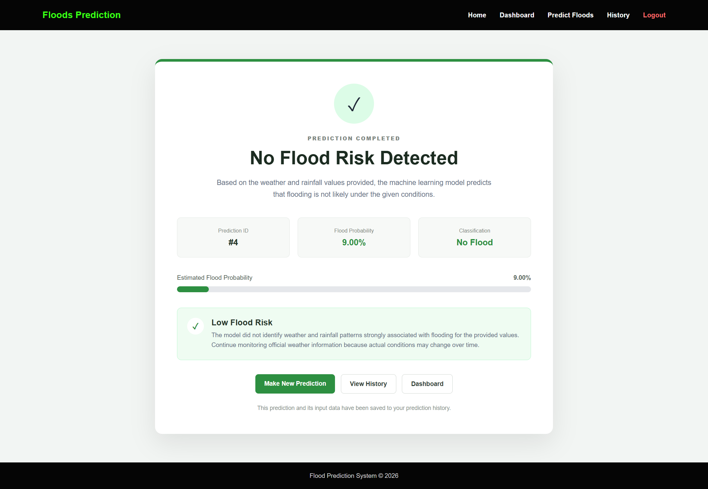
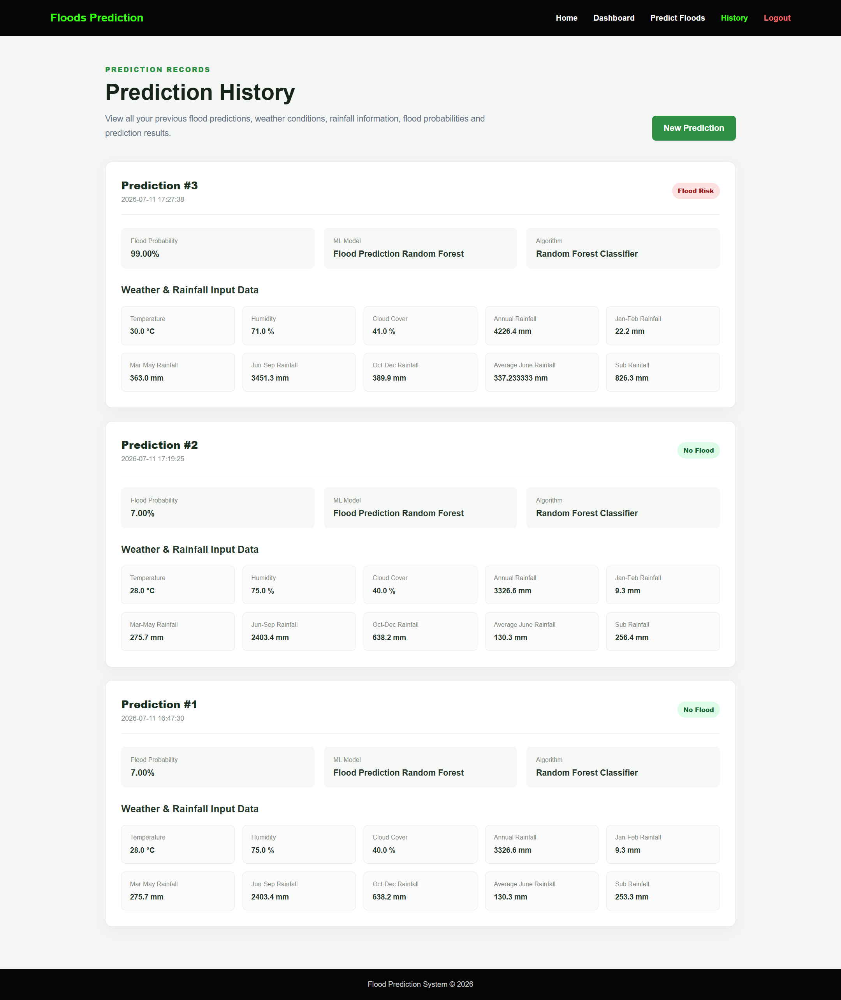

# 🌊 Flood Prediction Using Machine Learning

A full-stack Machine Learning-based web application that predicts the likelihood of flooding using weather and rainfall parameters.

The system is built using **Python**, **Flask**, and **Scikit-learn** and provides user authentication, a personalized dashboard, flood probability estimation, prediction history, and an interactive web interface.

---

## 🚀 Live Demo

### 🌐 Live Application

https://rising-water-l3ro.onrender.com

### 📂 GitHub Repository

https://github.com/RavitejaTulasi/Rising-water

---

# 📖 Project Overview

Floods are among the most destructive natural disasters, causing significant damage to human life, property, agriculture, and infrastructure. Early flood-risk assessment can help improve awareness and support preventive decision-making.

The **Flood Prediction System** is a Machine Learning-based web application that analyzes weather and rainfall parameters to estimate the possibility of flooding.

The system uses a trained **Random Forest Classifier** to process ten weather and rainfall features and generate:

- A flood-risk classification
- An estimated flood probability

The application also includes a complete user management and prediction tracking system. Users can create accounts, securely log in, submit weather and rainfall data, receive flood predictions, view their personal dashboard, and review their complete prediction history.

The system integrates:

- **Machine Learning** for flood prediction
- **Flask** for backend development
- **HTML, CSS, and JavaScript** for the frontend
- **Database storage** for users, weather data, model information, and prediction results
- **User authentication** for personalized access
- **Render** for cloud deployment

---

# ✨ Features

- 🌧️ Machine Learning-based flood-risk prediction
- 🤖 Random Forest Classifier integration
- 📊 Flood probability estimation
- 🔐 User registration and login
- 👤 User authentication and session management
- 📈 Personalized user dashboard
- 📋 Complete prediction history
- 💾 Weather and rainfall data storage
- 🗃️ Database-backed prediction records
- ⚠️ Flood-risk warning result page
- ✅ No-flood result page
- 📊 Prediction statistics
- 🕒 Prediction date and time tracking
- 🔄 Make multiple predictions
- 📱 Responsive web interface
- ☁️ Cloud deployment

---

# 🛠️ Technologies Used

## Programming Language

- Python 3

## Frontend

- HTML5
- CSS3
- JavaScript

## Backend

- Flask

## Machine Learning

- Scikit-learn
- Random Forest Classifier
- Logistic Regression
- Decision Tree
- XGBoost

## Python Libraries

- Pandas
- NumPy
- Joblib
- Matplotlib
- Seaborn
- OpenPyXL

## Database

- SQLite

## Deployment

- Render
- GitHub

---

# 📂 Project Structure

```text
FLOODPREDICTION/
│
├── app.py                       # Main Flask application
├── README.md                    # Project documentation
├── requirements.txt             # Python dependencies
├── Procfile                     # Render deployment configuration
├── Flood_Prediction.ipynb       # Machine Learning training notebook
│
├── data/
│   ├── flood_prediction.xlsx
│   └── rainfall in india 1901-2015.xlsx
│
├── models/
│   └── floods.save              # Trained Random Forest model
│
├── notebooks/
│   └── Rainfall_analysis.ipynb
│
├── static/
│   ├── flood.jpg                # Flood background image
│   ├── style.css                # Application styling
│   ├── script.js                # JavaScript functionality
│   │
│   └── screenshots/
│       ├── homepage.png
│       ├── login.png
│       ├── register.png
│       ├── dashboard.png
│       ├── prediction.png
│       ├── flood-detected.png
│       ├── no-flood.png
│       └── history.png
│
└── templates/
    ├── home.html                # Home page
    ├── login.html               # User login page
    ├── register.html            # User registration page
    ├── dashboard.html           # User dashboard
    ├── index.html               # Flood prediction form
    ├── chance.html              # Flood-risk result page
    ├── no_chance.html           # No-flood result page
    └── history.html             # Prediction history page
```

> The exact project structure may vary slightly depending on the database configuration and additional files used by the application.

---

# 📊 Dataset

The project uses historical rainfall and weather data for Machine Learning model training and flood prediction.

The model uses **10 input features**.

## Input Features

| No. | Feature | Description |
|---|---|---|
| 1 | Temperature | Atmospheric temperature in Celsius |
| 2 | Humidity | Relative humidity percentage |
| 3 | Cloud Cover | Percentage of sky covered by clouds |
| 4 | Annual Rainfall | Total annual rainfall |
| 5 | January-February Rainfall | Combined rainfall during January and February |
| 6 | March-May Rainfall | Combined rainfall from March to May |
| 7 | June-September Rainfall | Monsoon rainfall from June to September |
| 8 | October-December Rainfall | Combined rainfall from October to December |
| 9 | Average June Rainfall | Average rainfall measurement for June |
| 10 | Sub Rainfall | Additional rainfall feature used by the trained model |

## Target Variable

| Value | Prediction |
|---|---|
| `0` | No Flood |
| `1` | Flood |

---

# 🤖 Machine Learning Models

The following Machine Learning algorithms were trained and evaluated:

- Logistic Regression
- Decision Tree
- Random Forest
- XGBoost

## Model Performance

| Model | Accuracy |
|---|---:|
| Logistic Regression | **91.30%** |
| Decision Tree | **95.65%** |
| Random Forest | **95.65%** |
| XGBoost | **86.96%** |

After evaluating the models, the **Random Forest Classifier** was selected for deployment because of its high accuracy and robust performance.

---

# 🧠 Final Machine Learning Model

The deployed model is:

```text
RandomForestClassifier(random_state=42)
```

The trained model is saved using Joblib:

```text
models/floods.save
```

For every prediction, the model generates:

1. **Predicted Class**
   - `0` → No Flood
   - `1` → Flood Risk

2. **Flood Probability**
   - Estimated probability of the flood class

---

# 🔄 Machine Learning Workflow

```text
Historical Dataset
        │
        ▼
Data Collection
        │
        ▼
Data Cleaning & Preprocessing
        │
        ▼
Exploratory Data Analysis
        │
        ▼
Feature Selection
        │
        ▼
Train-Test Split
        │
        ▼
Model Training
        │
        ▼
Model Evaluation
        │
        ▼
Model Selection
        │
        ▼
Random Forest Classifier
        │
        ▼
Model Serialization
        │
        ▼
Flask Web Application
        │
        ▼
User Input
        │
        ▼
Flood Classification
        │
        ▼
Flood Probability
        │
        ▼
Prediction Stored in Database
```

---

# 🖥️ Application Workflow

```text
                    ┌─────────────────┐
                    │    Home Page    │
                    └────────┬────────┘
                             │
                 ┌───────────┴───────────┐
                 │                       │
                 ▼                       ▼
        ┌─────────────────┐     ┌─────────────────┐
        │    Register     │     │      Login      │
        └────────┬────────┘     └────────┬────────┘
                 │                       │
                 └───────────┬───────────┘
                             │
                             ▼
                    ┌─────────────────┐
                    │ User Dashboard  │
                    └────────┬────────┘
                             │
                             ▼
                    ┌─────────────────┐
                    │ Enter Weather & │
                    │  Rainfall Data  │
                    └────────┬────────┘
                             │
                             ▼
                    ┌─────────────────┐
                    │ Random Forest   │
                    │   Classifier    │
                    └────────┬────────┘
                             │
                  ┌──────────┴──────────┐
                  │                     │
                  ▼                     ▼
        ┌─────────────────┐   ┌─────────────────┐
        │   Flood Risk    │   │    No Flood     │
        │    Detected     │   │  Risk Detected  │
        └────────┬────────┘   └────────┬────────┘
                 │                     │
                 └──────────┬──────────┘
                            │
                            ▼
                   ┌─────────────────┐
                   │ Save Prediction │
                   │    History      │
                   └────────┬────────┘
                            │
                            ▼
                   ┌─────────────────┐
                   │ View Dashboard  │
                   │   & History     │
                   └─────────────────┘
```

---

# 🔐 User Authentication Flow

The application includes a user authentication system that allows users to create an account and maintain their own prediction history.

```text
New User
   │
   ▼
Register
   │
   ▼
Account Created
   │
   ▼
Login
   │
   ▼
User Dashboard
   │
   ├──► Make Prediction
   │
   ├──► View Prediction History
   │
   └──► Logout
```

Each authenticated user can access their own dashboard and prediction records.

---

# 🎯 System Modules

## 1. User Management Module

Handles:

- User registration
- User login
- User authentication
- User sessions
- User logout

---

## 2. Weather Data Module

Handles the 10 weather and rainfall input features required by the Machine Learning model.

The system stores the input values associated with each prediction.

---

## 3. Machine Learning Module

Uses the trained Random Forest Classifier to:

- Process weather and rainfall inputs
- Generate flood classifications
- Calculate flood probabilities

---

## 4. Prediction Result Module

Displays:

- Prediction ID
- Flood probability
- Flood classification
- Risk information
- Visual probability indicator

---

## 5. Dashboard Module

Provides:

- Total prediction count
- Flood prediction count
- No-flood prediction count
- Recent prediction activity
- Quick access to prediction
- Quick access to history

---

## 6. Prediction History Module

Stores and displays previous predictions for each authenticated user.

Each prediction contains:

- Prediction ID
- Prediction date and time
- Flood probability
- Prediction result
- Machine Learning model
- Algorithm
- Complete weather and rainfall input data

---

# 🗃️ Database Structure

The application follows a structured data model consisting of the following major entities.

## Users

Stores registered user information.

Example attributes:

- User ID
- Name
- Email
- Password
- Role

---

## Weather Data

Stores weather and rainfall information entered by users.

Example attributes:

- Data ID
- User ID
- Temperature
- Humidity
- Cloud Cover
- Annual Rainfall
- Seasonal Rainfall Features

---

## ML Model

Stores information about the Machine Learning model.

Example attributes:

- Model ID
- Model Name
- Algorithm Type
- Accuracy
- Model File

---

## Prediction Result

Stores the result generated by the Machine Learning model.

Example attributes:

- Prediction ID
- Data ID
- Model ID
- Flood Result
- Flood Probability
- Prediction Date

---

# 🔗 Entity Relationships

The application follows these primary relationships:

```text
User
 │
 ├──── 1 : N ──── Weather Data
 │
 └──── 1 : N ──── Prediction Results

Weather Data
 │
 └──── 1 : 1 ──── Prediction Result

ML Model
 │
 └──── 1 : N ──── Prediction Results
```

This structure allows each user to maintain multiple weather records and prediction results while each prediction references the Machine Learning model used.

---

# 📊 Prediction Result Information

For every prediction, the system stores and displays:

| Information | Description |
|---|---|
| Prediction ID | Unique identifier for the prediction |
| User | User who performed the prediction |
| Weather Data | Temperature, humidity and cloud cover |
| Rainfall Data | Annual and seasonal rainfall measurements |
| ML Model | Machine Learning model used |
| Algorithm | Random Forest Classifier |
| Flood Result | Flood Risk or No Flood |
| Flood Probability | Estimated probability generated by the model |
| Prediction Date | Date and time of prediction |

---

# 📸 Application Screenshots

The Flood Prediction System provides a complete web-based interface with user authentication, a personal dashboard, Machine Learning-based flood prediction, probability analysis, and prediction history.

---

## 🏠 Home Page

The home page introduces the Flood Prediction System and explains how Machine Learning is used to analyze weather and rainfall data for flood-risk prediction.

### Main Features

- Introduction to the Flood Prediction System
- Overview of weather and rainfall analysis
- Explanation of the Machine Learning prediction process
- System features overview
- Login and registration navigation
- Responsive user interface




---

## 🔐 Login Page

Registered users can log in to access the Flood Prediction System.

### Login Features

- Email-based authentication
- Password authentication
- Password visibility toggle
- Access to the user dashboard
- Link to create a new account



---

## 📝 Registration Page

New users can create an account to access the complete Flood Prediction System.

### Registration Features

- Full name input
- Email address registration
- Password creation
- Password confirmation
- Password visibility toggle
- Link for existing users to log in



---

## 📊 User Dashboard

After logging in, users are redirected to a personalized dashboard that provides an overview of their prediction activity.

### Dashboard Features

- Personalized welcome message
- Total number of predictions
- Number of flood-risk predictions
- Number of no-flood predictions
- Quick access to flood prediction
- Quick access to prediction history
- Recent prediction records
- Flood probability and classification summary


---

## 🌧️ Flood Prediction Page

The prediction page allows authenticated users to enter the weather and rainfall parameters required by the trained Machine Learning model.

### Weather Parameters

- Temperature
- Humidity
- Cloud Cover

### Rainfall Parameters

- Annual Rainfall
- January-February Rainfall
- March-May Rainfall
- June-September Rainfall
- October-December Rainfall
- Average June Rainfall
- Sub Rainfall

After entering all 10 required features, the data is passed to the trained Random Forest Classifier to generate the flood prediction and probability.



---

## ⚠️ Flood Risk Detected

When the Machine Learning model identifies weather and rainfall patterns associated with flooding, the system displays a flood-risk warning.

The result page displays:

- Prediction ID
- Flood probability
- Flood-risk classification
- Visual probability indicator
- Flood-risk warning
- Navigation to make another prediction
- Prediction history access
- Dashboard access

### Example Flood Prediction

```text
Temperature:                 30 °C
Humidity:                    71 %
Cloud Cover:                 41 %
Annual Rainfall:             4226.4 mm
January-February Rainfall:   22.2 mm
March-May Rainfall:          363.0 mm
June-September Rainfall:     3451.3 mm
October-December Rainfall:   389.9 mm
Average June Rainfall:       337.233333 mm
Sub Rainfall:                826.3 mm
```

### Prediction Result

```text
Flood Probability: 99.00%
Classification: Flood Risk
```



---

## ✅ No Flood Risk Detected

When the model does not identify patterns strongly associated with flooding, the system displays a low flood-risk result.

The result page displays:

- Prediction ID
- Estimated flood probability
- No-flood classification
- Visual probability indicator
- Low flood-risk information
- Navigation to make another prediction
- Prediction history access
- Dashboard access

### Example Result

```text
Flood Probability: 9.00%
Classification: No Flood
```



---

## 📋 Prediction History

The Prediction History page stores and displays previous predictions made by the logged-in user.

Each prediction record contains:

- Prediction ID
- Prediction date and time
- Flood probability
- Prediction result
- Machine Learning model name
- Algorithm used
- Temperature
- Humidity
- Cloud Cover
- Annual Rainfall
- January-February Rainfall
- March-May Rainfall
- June-September Rainfall
- October-December Rainfall
- Average June Rainfall
- Sub Rainfall

This allows users to review and compare their previous flood predictions.



---

# 🧪 Sample Input for Testing

## Flood Risk Example

The following sample is predicted by the trained model as a high flood-risk case:

| Feature | Value |
|---|---:|
| Temperature | 30 |
| Humidity | 71 |
| Cloud Cover | 41 |
| Annual Rainfall | 4226.4 |
| January-February Rainfall | 22.2 |
| March-May Rainfall | 363.0 |
| June-September Rainfall | 3451.3 |
| October-December Rainfall | 389.9 |
| Average June Rainfall | 337.233333 |
| Sub Rainfall | 826.3 |

### Expected Prediction

```text
Flood Probability: 99.00%
Classification: Flood Risk
```

> The prediction is based on the trained Machine Learning model and the historical dataset used in this project. It should not be treated as an official flood warning.

---

# ⚙️ Installation and Setup

## 1. Clone the Repository

```bash
git clone https://github.com/RavitejaTulasi/Rising-water.git
```

---

## 2. Navigate to the Project

```bash
cd Rising-water
```

---

## 3. Create a Virtual Environment

### Windows

```bash
python -m venv .venv
```

Activate the environment:

```bash
.venv\Scripts\activate
```

### Linux/macOS

```bash
python3 -m venv .venv
source .venv/bin/activate
```

---

## 4. Install Dependencies

```bash
pip install -r requirements.txt
```

---

## 5. Run the Application

```bash
python app.py
```

---

## 6. Open the Application

Open your browser and visit:

```text
http://127.0.0.1:5000
```

---

# 🌐 Deployment

The application is deployed on **Render**.

## Live Website

https://rising-water-l3ro.onrender.com

The deployment process includes:

1. Push the project to GitHub
2. Connect the GitHub repository to Render
3. Install dependencies from `requirements.txt`
4. Start the Flask application using Gunicorn
5. Deploy the application as a web service

---

# 📦 Requirements

The main dependencies used in the project include:

```text
Flask
gunicorn
numpy
pandas
scikit-learn
joblib
xgboost
openpyxl
matplotlib
seaborn
```

Install all dependencies using:

```bash
pip install -r requirements.txt
```

---

# 🔮 Future Enhancements

- 🌦️ Live Weather API integration
- 📍 Location-based flood prediction
- 🗺️ Interactive flood-risk maps
- 📧 Email and SMS flood-risk notifications
- 📱 Mobile application
- 🤖 Deep Learning models
- ☁️ Cloud database integration
- 📊 Real-time weather dashboard
- 🛰️ Satellite and geospatial data integration
- 📈 Advanced prediction analytics
- 🔑 Password reset functionality
- 👨‍💼 Admin dashboard
- 📥 Prediction report download
- 🔔 Real-time alert system

---

# ⚠️ Disclaimer

This project is developed for **educational and research purposes**.

The flood predictions generated by this system are based on:

- Historical data
- The trained Machine Learning model
- User-provided weather and rainfall values

The predictions should **not be considered official emergency warnings or disaster-management advice**.

For actual flood warnings and emergency information, always follow official weather departments and local authorities.

---

# 👥 Team Members

## Raviteja Tulasi

**B.Tech – Computer Science and Engineering (Artificial Intelligence)**  
**KKR & KSR Institute of Technology and Sciences**

GitHub: https://github.com/RavitejaTulasi

---

## Kodali Shamily

**B.Tech – Computer Science and Engineering (Artificial Intelligence)**  
**KKR & KSR Institute of Technology and Sciences**

GitHub: https://github.com/shamilykodali

---

## Kalari Lahari

**B.Tech – Computer Science and Engineering (Artificial Intelligence)**  
**KKR & KSR Institute of Technology and Sciences**

GitHub: https://github.com/lahari-kalari

---

# 🙏 Acknowledgements

This project was developed with the support of and using technologies from:

- SkillWallet
- Flask
- Scikit-learn
- Pandas
- NumPy
- XGBoost
- Render
- GitHub
- Open Source Community

---

# 📜 License

This project is developed for educational and learning purposes.

---

# ⭐ Support

If you found this project helpful, please consider giving the repository a ⭐ on GitHub.

Your support motivates future improvements and helps others discover the project.

---

# 📬 Contact

For questions, suggestions, or project-related discussions, connect through GitHub:

https://github.com/RavitejaTulasi

---

## 🌊 Flood Prediction Using Machine Learning

**Machine Learning • Flask • Random Forest • User Authentication • Dashboard • Prediction History**

⭐ Star the repository if you found the project useful.